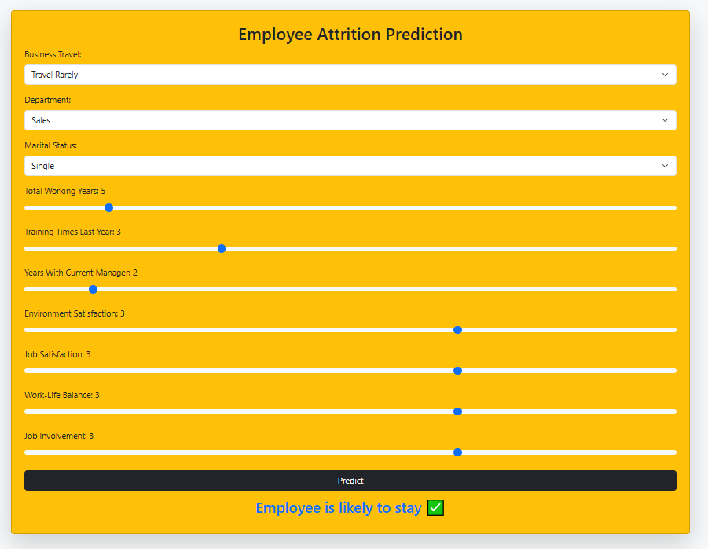

# Employee Attrition Prediction 📊

## Overview

This project predicts whether an employee is likely to leave a company (attrition 👋) using a machine learning model. It features a simple web interface built with Flask for easy interaction.

## Screenshot 📸

Here's a preview of the application:

## ✨ Features

* Predicts employee attrition (Stay ✅ / Leave ❌).
* Simple web UI for data entry.
* Powered by an XGBoost classifier.

## ⚙️ Technologies Used

* **Backend:** Python 🐍, Flask
* **ML/Data:** XGBoost, Scikit-learn, Pandas
* **Frontend:** HTML

## ⚠️ Disclaimer

This prediction model is intended for educational and demonstration purposes only. It should **not** be used as the sole basis for making real-world decisions regarding employee retention or management without further validation, ethical review, and consideration of individual circumstances.

---